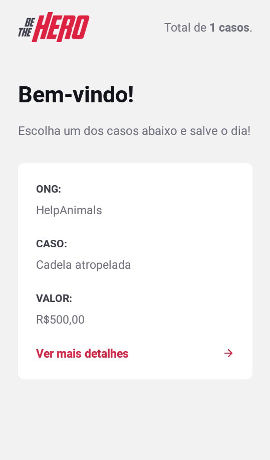
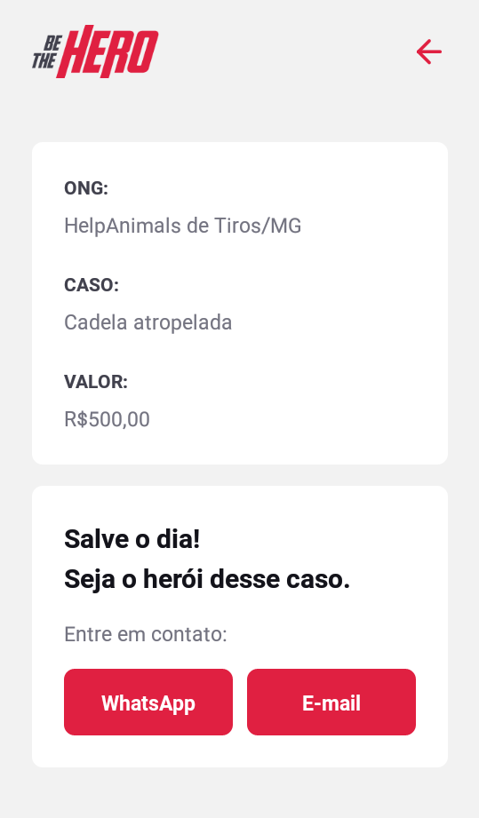

<h1 align="center">🦸‍♀️🦸‍♂️</h1>

 O projeto visa conectar pessoas que desejam fazer contribuições monetárias a ONG's (Organizações não governamentais) que precisam de ajuda.

Aplicação criada pela Rocketseat para a 11ª Semana Omnistack.

  
  
  
  
  
  
  

<h2>🚀 Tecnologias</h2>
<ul>
  <li>Node.js</li>
  <li>React</li>
  <li>React Native</li>
  <li>Express</li>
  <li>Knex</li>
  <li>Jest</li>
  <li>Expo</li>
</ul>

<h2>🔧 Instalação</h2>
<h3>Pré-requisitos:</h3>
<ul>
  <li><a href="https://nodejs.org/en/download/" title="Site Node.js">Node.js</a></li>
</ul>
OBS: o NPM já vem acompanhado do Node.js.

<h3>Clonar o projeto e instalar as dependências:</h3>
<ol>
  <li>Clone o repositório:
    <code>git clone https://github.com/ana-ferreiramg/be-the-hero.git</code>
  </li>
  <li>Execute o comando abaixo nas pastas backend, frontend e mobile:
    <code>npm install</code>
  </li>
</ol>

<h4><strong>Se houver erro na hora de instalar as dependências, siga as instruções a seguir:</strong></h4>
<ul>
  <li><a href="https://github.com/nodejs/node-gyp#installation">node-gyp - Node.js native addon build tool</a></li>
</ul>

Depois entre no diretório do projeto e tente instalar as dependências: <code>npm install</code>

<h2>🚩 Rodar aplicação</h2>

🔸 Para utilizar a versão web:

<ol>
  <li>Execute <code>npm start</code> nas pastas backend e frontend.</li>
</ol>

🔸 Versão mobile:

<ol>
  <li>Excute <code>npm start</code> nas pastas backend e mobile, vai abrir uma página web no seu navegador, leia o QR Code no seu celular com o aplicativo Expo .</li>
</ol>
